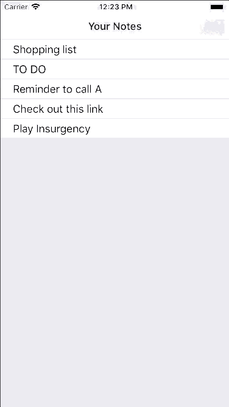
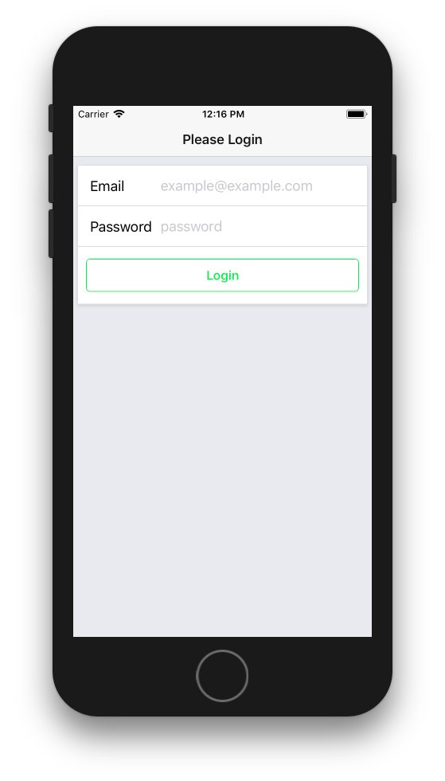
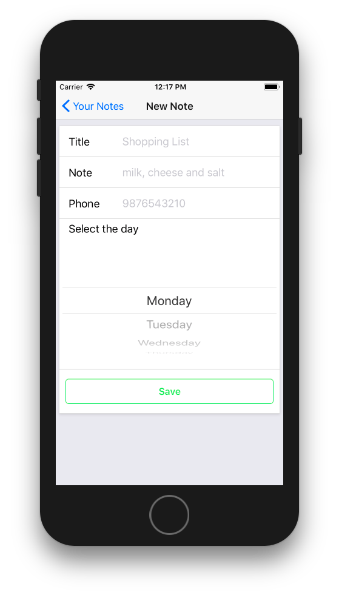
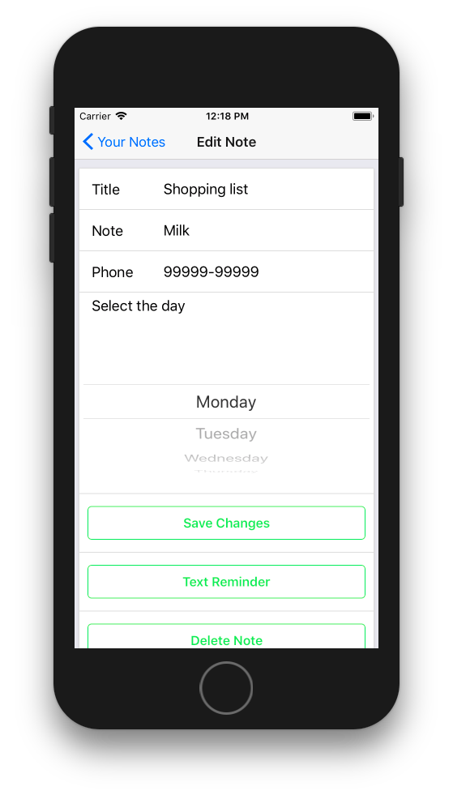

# NotesOnline
Store all your notes online securely

Hey there,

This repo contains an ios and android application which can be used to store notes online.
It is developed using react-native and redux. It uses firebase to store the data and to authenticate the user.

## Working

<p align="center">
  
</p>

## Screenshots

<p float="left">
  
   
  
</p>

## Features

1. Login/Signup in one form
2. Create as many notes you want
3. Text Reminder to a number
4. Attributes of a note are title, note, phone and day
5. Delete notes
6. Edit notes

## To get started

1. Download or clone this repo
2. Make sure you have node, react-native cli tools installed on your machine
3. cd to your project folder
4. Run this command to install all the dependencies 
```npm install```
5. Run this command to startup the app
```react-native run-ios``` or ```react-native run-android```

**Note**: The above mentioned guide has been tried and tested on mac. However, the same guide should also work on windows machines.

## Queries

email me at pranavj1001@gmail.com

## License

MIT License
